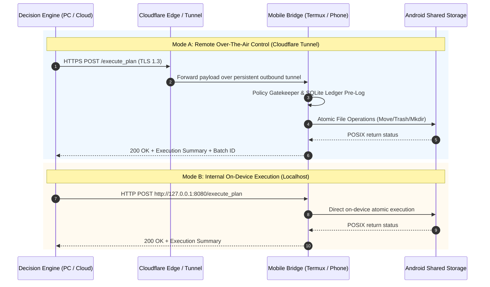
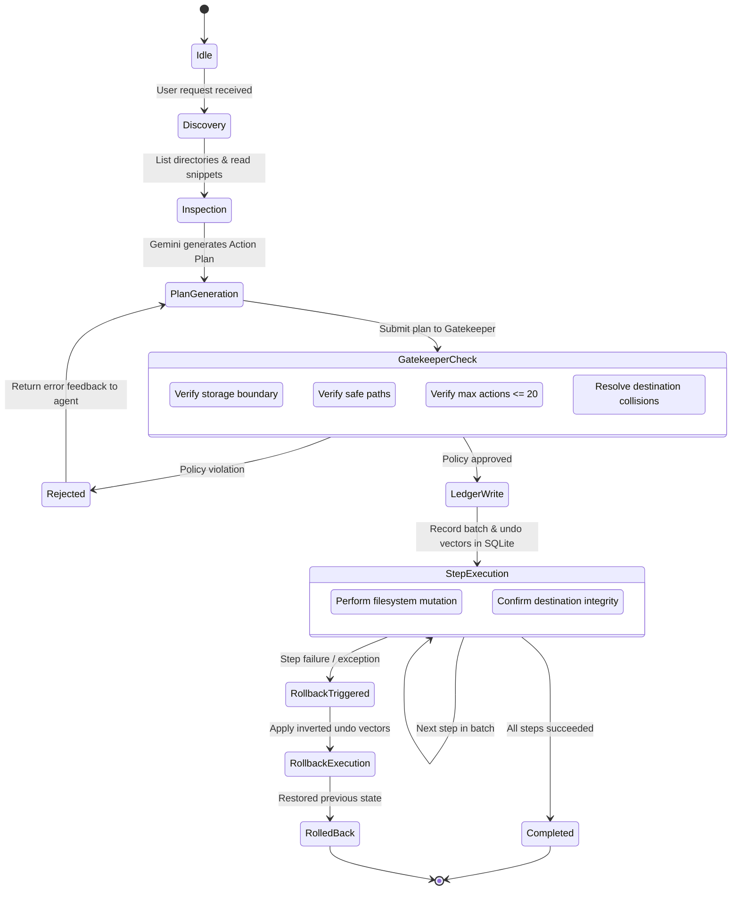

# System Architecture Specification

## 1. Executive Overview

The **Mobile Agent Storage Bridge** is a hybrid autonomous storage management framework designed to bridge high-intelligence AI reasoning engines (such as Gemini 3.5/Flash and on-device models) with mobile file system storage on Android devices.

The system addresses the fundamental friction between autonomous AI decision-making and mobile operating system constraints:
- Remote models lack direct OS-level file handles into sandboxed mobile environments.
- Mobile storage systems (Android SAF, emulated storage) are fragile and prone to irreversible user data loss if controlled via unrestricted agent mutations.
- Network environments between workstations, clouds, and mobile devices fluctuate across cellular, Wi-Fi, and sleep states.

To solve this, the platform is structured around a **Decoupled 3-Tier Architecture** supporting dual execution topologies: **External Cloud/Tunnel Control** and **Internal On-Device Execution**.

```mermaid
graph TD
    subgraph Tier 1: Decision Engine
        UserIntent[User Prompt / High-Level Goal] --> Planner[Gemini 3.5 Flash / LLM Reasoner]
        Planner --> Inspector[Semantic Context Inspector]
        Inspector --> ActionPlan[Declarative Action Plan (JSON)]
    end

    subgraph Tier 2: Policy Gatekeeper
        ActionPlan --> PathSandbox[Path Sandbox & Canonicalization]
        PathSandbox --> Blacklist[System & /Android Blacklists]
        Blacklist --> BlastRadius[Blast Radius Guard (Max 20/batch)]
        BlastRadius --> DryRun[Dry-Run Simulator & Diff Report]
    end

    subgraph Tier 3: Atomic Execution Driver
        DryRun --> LedgerPreLog[(SQLite Action Ledger: Pre-Log)]
        LedgerPreLog --> MobileDriver[Android Execution Driver]
        MobileDriver --> Storage[Android Shared Storage ~/storage/shared]
        MobileDriver --> TrashBucket[Soft-Delete Vault .agent_trash]
        MobileDriver --> RollbackHandler[Rollback Engine (Undo Vectors)]
        RollbackHandler -.-> Storage
    end
```

---

## 2. Decoupled 3-Tier Architecture

### 2.1 Tier 1: Decision Engine (Brain & Planner)
* **Location**: Workstation, Cloud Server, or On-Device Agent Runtime.
* **Core Responsibilities**:
  - Ingests high-level human directives (e.g., *"Find cryptic WhatsApp documents and organize them by topic"*).
  - Performs non-destructive, read-only reconnaissance (directory listings, text snippet extraction, PDF headers, metadata).
  - Synthesizes intent into a **Declarative Batch Action Plan** adhering to `SCHEMA_SPEC.md`.
  - **Decoupling Guarantee**: The Decision Engine has *zero direct filesystem mutation privileges*. It cannot invoke raw POSIX `unlink`, `rename`, or `mkdir`. It only outputs candidate Action Plans.

### 2.2 Tier 2: Policy Gatekeeper (Safety & Validation Layer)
* **Location**: Mobile Bridge Gateway / Middle-tier Validation Engine.
* **Core Responsibilities**:
  - Acts as a zero-trust firewall between the AI's proposal and the Android kernel.
  - **Path Canonicalization**: Resolves paths via `os.path.realpath`, stripping directory traversal attacks (`../`), symlink escapes, and URL encodings.
  - **Boundary Verification**: Enforces that all targets reside strictly within `~/storage/shared`.
  - **Blacklist Enforcement**: Rejects any access or modification attempt targeting sensitive directories (`/Android`, `.agent_trash`, hidden files, root filesystems).
  - **Blast Radius Verification**: Rejects any batch exceeding 20 atomic operations or mass payload thresholds without explicit out-of-band user approval.
  - **Collision Prevention**: Resolves naming clashes using configurable conflict resolution strategies (`fail`, `rename_numeric`, `rename_timestamp`).

### 2.3 Tier 3: Atomic Execution Driver (Muscle & Mobile Bridge)
* **Location**: Android Device Runtime (Termux daemon / Native Android Service).
* **Core Responsibilities**:
  - Receives validated Action Plans from the Gatekeeper.
  - **Pre-Execution Ledgering**: Logs transaction details and inverted undo vectors into `ledger.db` before executing disk writes.
  - **Zero Hard-Delete Invariant**: Intercepts delete directives and converts them into atomic moves to `.agent_trash/`.
  - **Two-Phase Execution**: Executes operations step-by-step with state verification. If any step fails, the driver halts execution and triggers automatic or manual rollback.
  - **Rollback Engine**: Capable of reading historical ledger batches and applying inverted operations to restore the filesystem to its exact prior state.

---

## 3. Network Topologies & Deployment Modes

The architecture natively supports two distinct operational topologies without changing client APIs or schema contracts:



### 3.1 Mode A: Remote Over-The-Air (OTA) Control via Cloudflare Tunnel
* **Use Case**: Developing from a workstation or running heavy LLMs in the cloud while manipulating files on a physical phone anywhere in the world.
* **Mechanism**:
  - The Android device runs `cloudflared tunnel --url http://localhost:8080`.
  - Creates a secure, authenticated, outbound WebSocket/QUIC tunnel to Cloudflare Edge.
  - Bypasses mobile NAT, CGNAT, dynamic carrier IPs, and Wi-Fi firewall limitations.
  - Client communicates via standard HTTPS using an authorization token.

### 3.2 Mode B: Internal Mobile / Local Network Execution
* **Use Case**: Fully offline, privacy-centric, or high-throughput local operations.
* **Mechanism**:
  - Decision Engine runs locally on the phone (via llama.cpp/Termux Python) or across the local Wi-Fi LAN (`http://192.168.x.x:8080`).
  - Completely operational without internet access.

---

## 4. Component Interaction Lifecycle



1. **Reconnaissance Phase**: Read-only endpoints (`/list_files`, `/read_file_snippet`) provide state to the AI.
2. **Plan Synthesis Phase**: The agent compiles an immutable `ActionPlan` containing targeted file moves, folder creations, and trash actions.
3. **Gatekeeper Validation**: The plan is simulated against policy rules.
4. **Ledger Commit**: An active batch is created in SQLite (`ledger.db`) storing undo vectors.
5. **Execution**: The mobile driver performs disk modifications sequentially.
6. **Finalization / Recovery**: On success, the batch is marked `COMMITTED`. On error, automatic rollback reverses changes using the pre-logged undo vectors.
