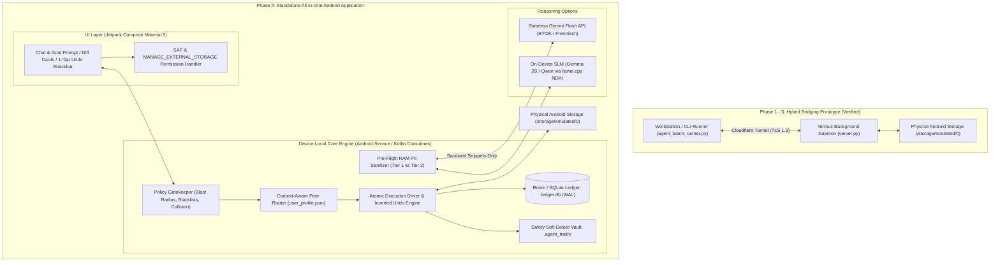
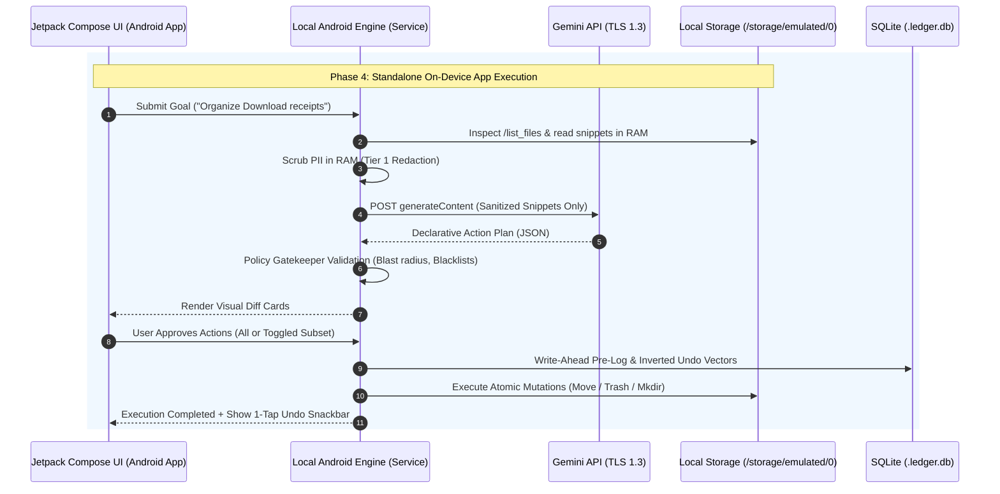

# System Architecture Specification: Mobile Agent Storage Bridge

## 1. Executive Summary & Core Operating Role

The **Mobile Agent Storage Bridge** is an autonomous, privacy-first mobile file management and semantic storage copilot engineered for Android internal storage (`/storage/emulated/0` / `~/storage/shared`). It bridges advanced reasoning models (e.g., Gemini 2.5/Flash, Gemini 3.5, and on-device quantized SLMs) with mobile filesystems under deterministic, non-negotiable security guardrails.

### 1.1 Core Operating Scope & Boundaries
- **Primary Role**: The agent operates strictly as a **local storage copilot**. It inspects messy directories, categorizes files, redacts sensitive previews, gathers content according to natural-language user instructions, isolates peer documents, and executes atomic, reversible filesystem mutations.
- **Zero Cloud Storage Architecture**: The platform **never stores, replicates, or uploads** user documents, images, directories, or databases to external cloud storage. All user files, transactional SQLite metadata ledgers (`.ledger.db`), safety soft-delete vaults (`.agent_trash`), and user profile configurations (`user_profile.json`) remain strictly on the physical device.
- **Fail-Closed Storage Scoping**: Operations are strictly confined to the user shared storage boundary (`BASE_DIR`). The agent is permanently blocked from reading, traversing, or modifying system trees (`/system`, `/proc`, `/sys`, `/data`), application private sandboxes (`/Android/data`, `/Android/obb`), `.git` repositories, or hidden dot-directories.

---

## 2. Architectural Evolution: From 3-Tier Prototype to Phase 4 Standalone Android App

The project evolves from an OTA developer bridge prototype into a fully integrated, standalone consumer Android application:



### 2.1 Decoupled Logical Tiers
Regardless of whether running via the Termux bridge or the Phase 4 native Android app, the architecture maintains strict separation between non-deterministic reasoning, zero-trust safety validation, and physical filesystem mutations:

1. **Tier 1: Decision Engine (Brain & Planner)**
   - Ingests natural-language instructions (e.g., *"Only organize receipts and fee vouchers"*, *"Gather machine learning papers into Documents/Research/ML"*, or contextual peer routing).
   - Performs read-only reconnaissance via directory listings and RAM-sanitized file snippet inspection.
   - Synthesizes intent into a declarative **Action Plan** conforming to `docs/SCHEMA_SPEC.md`.
   - **Decoupling Invariant**: The Decision Engine has *zero direct write access* to the OS filesystem. It cannot invoke raw POSIX `unlink`, `rename`, or `mkdir`.

2. **Tier 2: Policy Gatekeeper & Privacy Shield (Security Firewall)**
   - **Path Canonicalization**: Normalizes all paths via `os.path.realpath` (or Android `File.canonicalPath`), preventing directory traversal (`../`) and symlink escapes.
   - **Fail-Closed Boundary & Blacklists**: Rejects operations targeting `/Android`, `.agent_trash`, `.ledger.db`, `.git`, or system roots.
   - **Local RAM PII Shield**: Deterministically sanitizes inspection snippets on-device prior to any external transit.
   - **Blast Radius Protection**: Rejects batches exceeding 20 atomic operations or 500 MB cumulative mutation volume.
   - **Collision Prevention**: Resolves destination naming conflicts (`FAIL`, `RENAME_NUMERIC`, `RENAME_TIMESTAMP`, `SKIP`).
   - **Human-in-the-Loop Diff**: Requires interactive card/terminal approval prior to live execution.

3. **Tier 3: Atomic Execution Driver (Muscle & Rollback Engine)**
   - **Write-Ahead SQLite Pre-Logging**: Writes batch records and mathematically inverted undo vectors into `.ledger.db` before touching disk.
   - **Zero Hard-Delete Invariant**: Physical file deletion (`os.remove`, `rm`) is prohibited; all deletions are routed to `.agent_trash/`.
   - **Sequential Step Execution & Auto-Rollback**: Executes atomic operations step-by-step. If any operation fails, the driver halts and automatically reverts previously executed steps.
   - **1-Tap Rollback Engine**: Applies inverted operations in reverse order (`ORDER BY step_index DESC`) to restore storage byte-for-byte.

---

## 3. Fail-Safe Privacy Shield & Pre-Flight PII Sanitizer Matrix

To ensure absolute confidentiality during cloud-assisted reasoning, the system enforces a strict **RAM-Level Pre-Flight Sanitization Filter** before any text snippet leaves the physical device.

```
+-----------------------------------------------------------------------------+
|                          Device Physical Storage                            |
|             Raw PDF / Document / Receipt on /storage/emulated/0             |
+-----------------------------------------------------------------------------+
                                      |
                                      v
+-----------------------------------------------------------------------------+
|               Device-Local RAM Sanitizer (Kotlin / Python)                  |
|                                                                             |
|  [TIER 1: ZERO-TOLERANCE REDACTION]                                         |
|  - CNIC / National ID (\b\d{5}-\d{7}-\d\b)         -> [REDACTED_CNIC]       |
|  - Passports / Tax IDs (\b[A-PR-WY][1-9]\d\s?\d{4}[1-9]\b) -> [REDACTED_ID] |
|  - Payment Cards (\b(?:\d{4}[- ]?){3}\d{4}\b)       -> [REDACTED_CARD]     |
|  - Bank IBANs (\b[A-Z]{2}\d{2}[A-Z0-9]{11,30}\b)   -> [REDACTED_IBAN]     |
|  - Phone Numbers ((?:\+92[- ]?|0)?3\d{2}[- ]?\d{7}) -> [REDACTED_PHONE]    |
|  - Passwords, PINs, API Tokens, Secrets            -> [REDACTED_SECRET]   |
|  - Personal Email Addresses                         -> [REDACTED_EMAIL]    |
|                                                                             |
|  [TIER 2: SAFE RETAINED CONTEXT]                                            |
|  - Challan / Voucher / Invoice Numbers (e.g. 182-0982-A)                    |
|  - Student Roll Numbers & Registration IDs (e.g. BSAI-182)                  |
|  - Course Codes & Academic Subjects (e.g. CS-301, Machine Learning)         |
|  - Institutional / University / Bank Names (e.g. HBL, FAST, NUST)           |
|  - Monetary Amounts & Dates (e.g. PKR 145,000, 2026-10-06)                 |
+-----------------------------------------------------------------------------+
                                      |
                 (Sanitized Text Snippet Only via TLS 1.3)
                                      v
+-----------------------------------------------------------------------------+
|                        Stateless Decision Engine                            |
|  - Strictly forbidden from guessing or reconstructing PII                   |
|  - Uses Tier 2 tokens for high-fidelity contextual sorting & categorization|
|  - Zero raw image uploads (strictly metadata-driven: EXIF year/month)       |
+-----------------------------------------------------------------------------+
```

### 3.1 Two-Tier Sanitization Matrix

| Tier | Classification | Examples & Regex Patterns | Action | Rationale |
| :--- | :--- | :--- | :--- | :--- |
| **Tier 1** | **Zero-Tolerance Redaction** | • CNIC: `\b\d{5}-\d{7}-\d\b`<br>• Phone: `(?:\+92[- ]?\|0)?3\d{2}[- ]?\d{7}\b`<br>• Card: `\b(?:\d{4}[- ]?){3}\d{4}\b`<br>• IBAN: `\b[A-Z]{2}\d{2}[A-Z0-9]{11,30}\b`<br>• Email: `\b[A-Za-z0-9._%+-]+@[A-Za-z0-9.-]+\.[A-Za-z]{2,}\b`<br>• Secrets / Passwords / PINs | **Scrubbed to token** (`[REDACTED_*]`) | Prevents identity theft, financial fraud, and credential leakage. |
| **Tier 2** | **Safe Retained Context** | • Challan / Voucher No: `Challan #182-9021`<br>• Student ID: `BSAI-182`, `21K-3819`<br>• Course Code: `CS-401`, `AI-202`<br>• Bank / Issuer: `HBL`, `Meezan`, `FAST`<br>• Amounts: `PKR 145,000`, `$45.00`<br>• Dates: `October 2026`, `2026-10-06` | **Retained in plaintext** | Vital for accurate classification (distinguishing fee vouchers from lab reports and identifying course subjects). |

---

## 4. Context-Aware Peer Routing Subsystem (`user_profile.json`)

To prevent classmates, colleagues, or client documents from polluting personal user folders, the bridge incorporates a **Device-Local User Profile and Peer Isolation Matrix**:

```
+-----------------------------------------------------------------------------+
|                   Local user_profile.json (On Device)                       |
|  User Identity: Imran Tahir (Aliases: imran, BSAI-182)                      |
|  Known Peers:   Fawad, Sumbal, Ahmed, Yousaf                                |
|  Routing:       peer_documents_base = "Documents/Peers"                     |
|                 personal_documents_base = "Documents/Personal"             |
+-----------------------------------------------------------------------------+
                                      |
                                      v
+-----------------------------------------------------------------------------+
|                        Incoming Unorganized File                            |
|             "fawad fee challan.pdf" / "sumbal assignment.docx"              |
+-----------------------------------------------------------------------------+
                                      |
                                      v
+-----------------------------------------------------------------------------+
|                   Contextual Peer Isolation Decision                        |
|  1. Does file match known peer alias? -> YES (Peer: Fawad)                  |
|  2. Destination: "Documents/Peers/Fawad/fawad_fee_challan.pdf"              |
|  3. NEVER route to: "Documents/Personal/Receipts/"                          |
+-----------------------------------------------------------------------------+
```

### 4.1 Peer Separation Invariants
1. **Zero Peer Pollution**: Documents belonging to recognized peers or third parties are never filed into `personal_documents_base`.
2. **Dedicated Peer Folders**: Recognized peers receive dedicated directories (e.g. `Documents/Peers/Fawad/`).
3. **Ambiguity Handling**: If ownership is ambiguous, the file remains in an unassigned staging directory or the user is prompted via UI diff review.

---

## 5. Semantic Search & File Gathering Subsystem

The architecture provides two complementary retrieval mechanisms:

### 5.1 Deterministic Historical Search (`/lookup_history` / `--find`)
* **Purpose**: Instant, zero-cost, 100% deterministic lookup tracing the historical lineage of moved, renamed, or soft-deleted files.
* **Mechanism**: Queries `action_ledger` and `trash_index` in SQLite (`ledger.db`) without touching file content or invoking an LLM.
* **Guarantee**: Traces former file paths (e.g., `Download/1508.06576v2.pdf`) directly to their current destinations or trashed vault records.

### 5.2 Semantic Content Search & Gathering (`--gather` / `--find`)
* **Purpose**: Natural-language content location and structured aggregation (e.g., *"Gather all machine learning papers into Documents/Research/ML"* or *"Find my operating systems lab"*).
* **Pipeline**:
  1. **Reconnaissance**: Discovers candidate files using `/list_files` and RAM-sanitized `/read_file_snippet`.
  2. **Plan Compilation**: Generates a standard Action Plan with `make_dir` followed by `move` or `copy` operations.
  3. **Blast Radius Validation**: Max 20 files per gathering batch.
  4. **Diff Review & Confirmation**: Displays interactive diff preview requiring user approval.
  5. **Atomic Execution & 1-Tap Rollback**: Logs undo vectors to `ledger.db` for complete reversibility.

---

## 6. Phase 4 Native Standalone Mobile Client Architecture

In Phase 4, the entire system is packaged as an independent, standalone Android app, removing the requirement for Termux, Python interpreters, or Cloudflare tunnels for local usage.

### 6.1 Native Frontend Architecture (Jetpack Compose Material 3)
- **Declarative Reactive UI**: Built with Jetpack Compose, featuring Material 3 theming, dark mode support, and smooth micro-animations.
- **Natural Language Chat/Goal Bar**: Clean prompt bar for typing or speaking organization goals (e.g., *"Organize my downloads from last week"*, *"Gather fee vouchers"*).
- **Interactive Visual Diff Cards**:
  - Displays proposed operations as expandable cards with file type icons, original location, proposed destination, file size, and operation badge (`MOVE`, `COPY`, `TRASH`).
  - **Granular Toggles**: Checkbox or swipe toggle on each card enabling users to approve or exclude specific actions before execution.
- **1-Tap Rollback Snackbar & Notification Shade Action**:
  - Following execution, a persistent Snackbar provides a 1-tap "UNDO" action.
  - A device notification offers an instant "Rollback Last Batch" button without needing to open the app.

### 6.2 Permission Management & Local File Access
- **Android 11+ (API 30+)**: Requests `MANAGE_EXTERNAL_STORAGE` (`android.permission.MANAGE_EXTERNAL_STORAGE`) via `ACTION_MANAGE_ALL_FILES_ACCESS_PERMISSION` for unconstrained file management across `/storage/emulated/0`.
- **Scoped Fallback**: Implements Storage Access Framework (SAF) document tree picker for scoped directory access if full disk access is restricted.

### 6.3 Embedded Core Engine & Local Persistence
- **Foreground Android Service**: Long-running background execution runs as an Android Foreground Service with CPU wake-lock (`PowerManager.PARTIAL_WAKE_LOCK`), preventing termination by battery optimization daemons.
- **Native Room / SQLite Database**: The `ledger.db` schema is implemented using Android Room / SQLite with WAL mode.
- **Embedded Engine Runtime**: Implemented directly in native Kotlin coroutines (or embedded Chaquopy Python runtime for 1:1 code reuse during transition).

### 6.4 Inference Options & Monetization Model
1. **Bring-Your-Own-Key (BYOK)**:
   - Users can securely store their own Gemini or OpenAI API key in Android `EncryptedSharedPreferences`.
   - 100% free forever; no server fees or recurring subscription required.
2. **Freemium Tier with AdMob**:
   - Free daily tier (e.g., 3 batch operations per day).
   - Users can unlock extra runs by watching rewarded video ads via Google AdMob.
3. **Pro Subscription**:
   - Monthly/annual subscription unlocking unlimited runs, automated background daily scheduled audits, and advanced custom routing rules.
4. **On-Device Quantized SLM (100% Offline)**:
   - Integrates `llama.cpp` Android NDK bindings to run quantized Gemma 2B or Qwen 2.5 1.5B locally on the device NPU/CPU with zero internet connectivity.

---

## 7. Deployment Topologies



| Topology | Target Audience | Components | Connectivity |
| :--- | :--- | :--- | :--- |
| **Topology A: Remote OTA Bridge** | Developers & Power Users | Workstation CLI (`agent_batch_runner.py`) + Cloudflare Tunnel + Phone Termux Daemon (`server.py`) | Outbound TLS 1.3 via Cloudflare |
| **Topology B: Local Termux CLI** | Advanced Mobile Power Users | Termux Python CLI running directly on device (`--local` / `http://127.0.0.1:8080`) | Localhost only |
| **Topology C: Native Android Standalone App (Phase 4)** | Everyday Consumers & Mobile Users | Jetpack Compose APK + Native Android Service + Room DB + Local RAM Sanitizer | Direct on-device storage access + Stateless Gemini API (BYOK/Freemium) |
