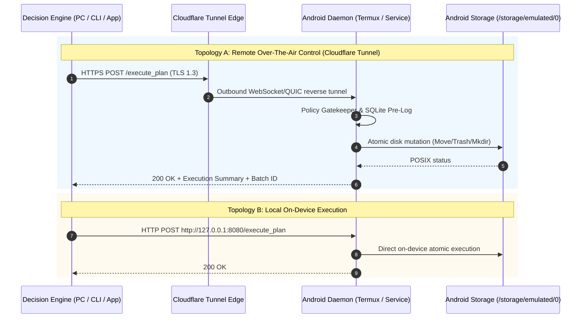

# System Architecture Specification: Mobile Agent Storage Bridge

## 1. Executive Summary & Core Operating Role

The **Mobile Agent Storage Bridge** is an autonomous, privacy-first mobile file management and semantic storage copilot engineered for Android internal storage (`/storage/emulated/0` / `~/storage/shared`). It bridges advanced reasoning models (e.g., Gemini 3.5/Flash and on-device quantized SLMs) with mobile filesystems under deterministic, non-negotiable security guardrails.

### 1.1 Core Operating Scope & Boundaries
- **Primary Role**: The agent operates strictly as a **local storage copilot**. It inspects messy directories, categorizes files, redacts sensitive previews, gathers content according to natural-language user instructions, and executes atomic, reversible filesystem mutations.
- **Zero Cloud Storage Architecture**: The platform **never stores, replicates, or uploads** user documents, images, directories, or databases to external cloud storage. All user files, transactional SQLite metadata ledgers (`.ledger.db`), and safety soft-delete vaults (`.agent_trash`) remain strictly on the physical device.
- **Fail-Closed Storage Scoping**: Operations are strictly confined to the user shared storage boundary (`BASE_DIR`). The agent is permanently blocked from reading, traversing, or modifying system trees (`/system`, `/proc`, `/sys`, `/data`), application private sandboxes (`/Android/data`, `/Android/obb`), `.git` repositories, or hidden dot-directories.

---

## 2. Decoupled 3-Tier Architecture

The architecture enforces a strict separation of concerns between non-deterministic AI reasoning, zero-trust safety validation, and physical filesystem mutations:

```mermaid
graph TD
    subgraph Tier 1: Decision Engine
        UserGoal[Natural Language Goal / --prompt] --> Planner[Gemini 3.5 Flash / SLM Reasoner]
        Planner --> Inspector[Semantic Context Inspector]
        Inspector --> ActionPlan[Declarative Action Plan (JSON)]
    end

    subgraph Tier 2: Policy Gatekeeper & Privacy Shield
        ActionPlan --> PathSandbox[Path Sandbox & Canonicalization]
        PathSandbox --> PIIShield[PII Sanitizer & Privacy Shield]
        PIIShield --> Blacklist[System & /Android & .git Blacklists]
        Blacklist --> BlastRadius[Blast Radius Guard (Max 20/batch)]
        BlastRadius --> DryRun[Dry-Run Simulator & Diff Report]
    end

    subgraph Tier 3: Atomic Execution Driver
        DryRun --> LedgerPreLog[(SQLite Action Ledger: Pre-Log)]
        LedgerPreLog --> MobileDriver[Android Execution Driver]
        MobileDriver --> Storage[Android Storage /storage/emulated/0]
        MobileDriver --> TrashBucket[Soft-Delete Vault .agent_trash]
        MobileDriver --> RollbackHandler[Rollback Engine (Undo Vectors)]
        RollbackHandler -.-> Storage
    end
```

### 2.1 Tier 1: Decision Engine (Brain & Planner)
* **Location**: Workstation, Cloud LLM, or On-Device SLM Runtime.
* **Core Function**:
  - Ingests natural-language instructions (e.g., *"Only organize receipts and fee vouchers"* or *"Gather all machine learning papers into Documents/Research/ML"*).
  - Performs read-only reconnaissance via `/list_files` and PII-sanitized `/read_file_snippet`.
  - Synthesizes intent into a declarative **Action Plan** conforming to `docs/SCHEMA_SPEC.md`.
  - **Decoupling Invariant**: The Decision Engine has *zero direct write access* to the OS kernel. It cannot invoke raw POSIX `unlink`, `rename`, or `mkdir`.

### 2.2 Tier 2: Policy Gatekeeper & Privacy Shield (Security Firewall)
* **Location**: Mobile Bridge Gateway (`server.py`).
* **Core Function**:
  - **Path Canonicalization**: Normalizes all paths via `os.path.realpath`, preventing directory traversal (`../`) and symlink escapes.
  - **Fail-Closed Boundary & Blacklists**: Rejects operations targeting `/Android`, `.agent_trash`, `.ledger.db`, `.git`, or system roots.
  - **Local Pre-Flight PII Shield**: Sanitizes inspection snippets on-device prior to network transit.
  - **Blast Radius Protection**: Rejects batches exceeding 20 atomic operations.
  - **Collision Prevention**: Resolves destination naming conflicts (`FAIL`, `RENAME_NUMERIC`, `RENAME_TIMESTAMP`, `SKIP`).
  - **Human-in-the-Loop Diff**: Requires interactive terminal/UI diff review and confirmation prior to live execution.

### 2.3 Tier 3: Atomic Execution Driver (Muscle & Rollback Engine)
* **Location**: Android Device Runtime (Termux daemon / Native Android Service).
* **Core Function**:
  - **Write-Ahead SQLite Pre-Logging**: Writes batch records and mathematically inverted undo vectors into `ledger.db` before modifying disk.
  - **Zero Hard-Delete Invariant**: Physical file deletion (`os.remove`, `rm`) is prohibited; deletions are routed to `.agent_trash/`.
  - **Sequential Step Execution & Auto-Rollback**: Executes atomic operations step-by-step. If any operation fails, the driver halts and automatically reverts previously executed steps.
  - **1-Tap Rollback Engine**: Applies inverted operations in reverse order (`ORDER BY step_index DESC`) to restore storage byte-for-byte.

---

## 3. Fail-Safe Privacy Shield & Pre-Flight PII Filter

To protect user confidentiality during cloud-assisted reasoning, the bridge enforces an uncompromised **Local Pre-Flight PII Filter**:

```
+-----------------------------------------------------------------------------+
|                          Device Physical Storage                            |
|             Raw PDF / Document / Receipt on /storage/emulated/0             |
+-----------------------------------------------------------------------------+
                                      |
                                      v
+-----------------------------------------------------------------------------+
|                  Local Python / Kotlin Pre-Flight Sanitizer                 |
|  Scrubs: CNIC (\b\d{5}-\d{7}-\d\b)           -> [REDACTED_CNIC]             |
|          Phone ((?:\+92[- ]?|0)?3\d{2}...)   -> [REDACTED_PHONE]            |
|          Payment Card (\b(?:\d{4}[- ]?)...)  -> [REDACTED_CARD]             |
|          Email Addresses                     -> [REDACTED_EMAIL]            |
+-----------------------------------------------------------------------------+
                                      |
                 (Sanitized Text Snippet Only via TLS 1.3)
                                      v
+-----------------------------------------------------------------------------+
|                        Stateless Decision Engine                            |
|  - Strictly forbidden from guessing or outputting PII                      |
|  - Treats text purely as categorical labels ("Fee Voucher", "Assignment")   |
|  - Zero raw image uploads (strictly metadata-driven: EXIF year/month)       |
+-----------------------------------------------------------------------------+
```

1. **Deterministic Scrubbing**: Applied on `/read_file_snippet` before any bytes are serialized into HTTP responses.
2. **Model Constraint**: System prompt forbids the LLM from attempting to reconstruct PII or proposing destination filenames with personal names or card numbers.
3. **Zero Raw Image Uploads**: Image/video handling is strictly metadata-driven (filenames, file sizes, timestamps, local EXIF year/month). Raw image pixels and video frames are never transmitted.

---

## 4. Semantic Search & File Gathering Subsystem

The architecture provides two complementary retrieval mechanisms:

### 4.1 Deterministic Historical Search (`/lookup_history`)
* **Purpose**: Instant, 100% deterministic lookup tracing the lineage of renamed, moved, or soft-deleted files.
* **Mechanism**: Queries `action_ledger` and `trash_index` in SQLite (`ledger.db`) without touching file content.
* **Guarantee**: Resolves old file paths (e.g. `Download/1508.06576v2.pdf`) to their current destinations (e.g. `Documents/Research/Computer_Vision/Neural_Algorithm_of_Artistic_Style_Gatys.pdf`).

### 4.2 Semantic Content Search & Gathering (`--find` / `--gather`)
* **Purpose**: Natural-language content location and structured aggregation (e.g., *"Gather all machine learning papers into Documents/Research/ML"* or *"Find my operating systems lab"*).
* **Pipeline**:
  1. **Reconnaissance**: Discovers candidate files using `/list_files` and PII-sanitized `/read_file_snippet`.
  2. **Plan Compilation**: Generates a standard Action Plan with `make_dir` followed by `move` or `copy` operations.
  3. **Blast Radius Validation**: Max 20 files per gathering batch.
  4. **Diff Review & Confirmation**: Displays terminal diff preview requiring user approval.
  5. **Atomic Execution & 1-Tap Rollback**: Logs undo vectors to `ledger.db` for full reversibility.

---

## 5. Deployment Topologies



### 5.1 Topology A: Remote Over-The-Air Control (Cloudflare Tunnel)
* Bypasses carrier CGNAT, dynamic cellular IPs, and Wi-Fi firewalls via persistent outbound Cloudflare tunnels.
* Allows workstations or cloud agents to manage phone storage anywhere in the world securely over TLS 1.3.

### 5.2 Topology B: Internal Mobile Execution
* Fully offline, high-throughput execution running directly on the Android device (via Termux Python or native Android app).
* Zero external internet dependency when paired with local SLMs (llama.cpp).

---

## 6. Standalone Consumer Mobile Client Roadmap (Phase 4)

Evolving from developer CLI scripts into a standalone consumer Android mobile application:

1. **Native UI & Diff Cards**: Standalone Jetpack Compose / Flutter client rendering clear mutation cards with 1-tap approval and 1-tap rollback from notification shades.
2. **Inference Modes**:
   - **BYOK (Bring-Your-Own-Key)**: Zero-cost tier allowing users to plug in their own Gemini or OpenAI API keys.
   - **Freemium Tier**: Daily free organization quota supported by rewarded ads via Google AdMob.
   - **Pro Subscription**: Automated scheduled daily storage audits and custom rule builders.
3. **Hybrid Split-Brain Router**: On-device SLM (Gemma 2B / Qwen 2.5 1.5B via llama.cpp) performs fast pre-flight inspection and PII redaction; Remote Gemini handles complex multi-step reasoning.
